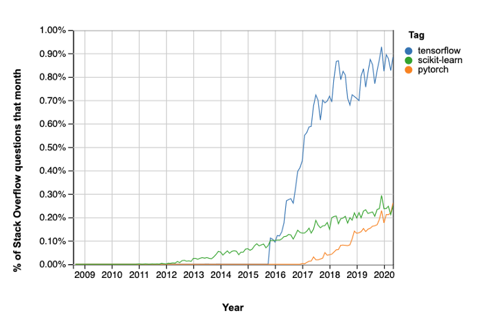
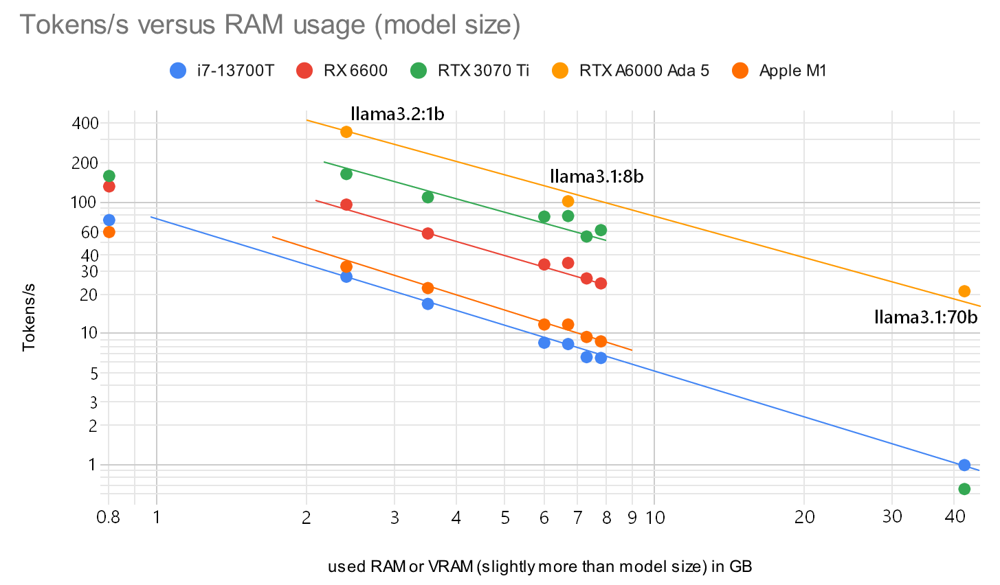
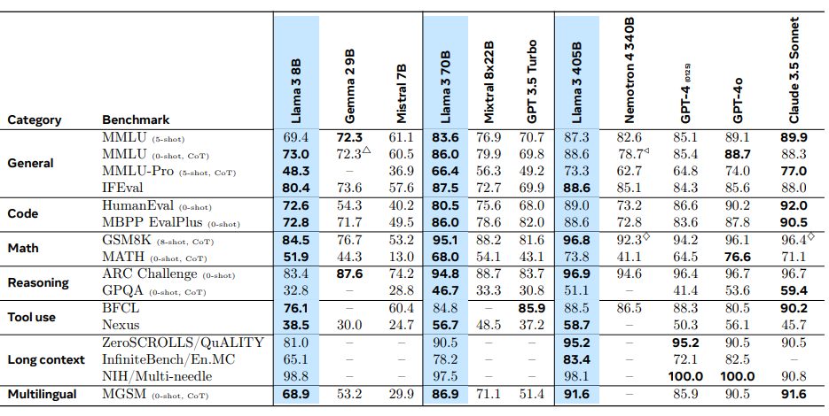

# ML - machine learning

This is just a documentation of my learning progress. 

## 2018 - Start with Object Detection

Inspired by object detection for cars with DarkNet (see this [TED talk from 2017](https://www.youtube.com/watch?v=Cgxsv1riJhI) by Joseph Redmon) and David's bachelor work at [HCMUTE](http://en.hcmute.edu.vn/) in connection with a car at the end of 2018 I started to learn more about machine learning.

Posenet runs on TensorFlow.lite in a browser on WebGL even on a smartphone. We tested it in December 2018 in Seoul, Korea. In March 2019 I got TensorFlow.js running with my RX470 with 43 fps. 


During 2019 NVIDIA announced the [Jetson Nano](https://en.wikipedia.org/wiki/Nvidia_Jetson) developer kit and with students from AISVN we try to win one in a competition. Eventually we order a package.


Early 2020 some supply chains delay orders, but we finally have the hardware. Now it needs to be combined - and development stalls until 2024.

### Facemesh example

<!--

-->


### Schedule for 2020

In [this article](https://towardsdatascience.com/from-a-complete-newbie-to-passing-the-tensorflow-developer-certificate-exam-d919e1e5a0f3) Harsheev Desai describes his journey to become a TensorFlow Developer with Certificate in 5 months.

#### 1. Learn Python
- [Python bootcamp at udemy](https://www.udemy.com/course/complete-python-bootcamp/)
- [Coursera python](https://www.coursera.org/specializations/python#courses)
- [List of 10 courses at medium.com](https://medium.com/better-programming/top-5-courses-to-learn-python-in-2018-best-of-lot-26644a99e7ec)

#### 2. Learn Machine Learning Theory
 
- [Coursera Machine Learning](https://www.coursera.org/learn/machine-learning/home/welcome) on Statistics, Calculus and Linear Algebra

#### 3. Learn Data Science Libraries

Some of these libraries are Pandas (data manipulation and analysis), Numpy (support for multi-dimensional arrays and matrices), Matplotlib (plotting) and Scikitlearn (creating ML models).

- [Pandas videos](https://www.youtube.com/playlist?list=PLeo1K3hjS3uuASpe-1LjfG5f14Bnozjwy)
- [NumPy videos](https://www.youtube.com/watch?v=QUT1VHiLmmI) or [freeCodeCamp](http://freecodecamp.org/)
- [MatPlotLib videos](https://www.youtube.com/playlist?list=PLQVvvaa0QuDfefDfXb9Yf0la1fPDKluPF)
- [Scikitlearn at udemy](https://www.udemy.com/course/machinelearning/) or [3 hour video](https://www.youtube.com/watch?v=pqNCD_5r0IU)

#### 4. Deep Learning Theory

- [Coursera Deep Learning](https://www.coursera.org/specializations/deep-learning?#courses)
- [Inner workings of DNN in practical implementations](https://medium.com/analytics-vidhya/what-i-learned-from-building-a-deep-neural-network-from-scratch-and-why-you-should-do-it-too-a2e6f422d3db)

#### 5. TensorFlow Certificate

- [Coursera TensorFlow in Practice](https://www.coursera.org/professional-certificates/tensorflow-in-practice#courses)

One reason for tensorflow can be seen in this graph regarding popularity on stack overflow:



More about the certificate [here on medium](https://medium.com/@harshit_tyagi/google-certified-tensorflow-developer-learning-plan-tips-faqs-my-journey-9f88016048e3). It was [introduced in March 2020](https://blog.tensorflow.org/2020/03/introducing-tensorflow-developer-certificate.html) but by 2024 it [no longer exists](https://www.tensorflow.org/certificate).

## 2022 - Teach ML in [Advanced Automation](https://github.com/ssis-aa) at SSIS in Unit 5


As covered in a [SSIS Stories](https://www.ssis.edu.vn/student-life/post-details/~board/hs/post/robots-on-a-roll-automation-and-algorithms) in March 2022 we made great progress in creating our own Neural Network, Training it and then doing interference on them. See also [our website](https://sites.google.com/ssis.edu.vn/automation).

If you think about possible learning experiences, we tried a few ones with our students:

- __Create__ your own neural network, generate training data, __train__ your model (with loss and test) and then use the trained model (__inference__). It was part of the SSIS course _Advanced Automation_ [https://github.com/ssis-aa/machine-learning](https://github.com/ssis-aa/machine-learning)
- __Image classification__: Select training data (for example of seagulls) and train a ML model in xcode on your Mac to properly identify your test set of images. It was part of the SSIS course App Development
- Build your __own GPT__. A phantastic course by Andrej Karpathy with his [nanoGPT](https://github.com/karpathy/nanoGPT) model guides you in a [2-hour video](https://www.youtube.com/watch?v=kCc8FmEb1nY) to create endless Shakespeare. With Googles offerings inside a [Colab Jupyter notebook](https://colab.research.google.com/drive/1JMLa53HDuA-i7ZBmqV7ZnA3c_fvtXnx-?usp=sharing) you can train your model without a GPU just in the cloud for free.
- Run your __local LLM__. With Meta providing the weights for their llama model with 8b, 70b and 405b parameter it is possible in 2024 to run a LLM on your local CPU or GPU. OF course there are some limitations in speed and VRAM size, but that's part of the learning. [Ollama](https://ollama.com/) is a good starting point.
- Update your local LLM with RAG (Retrieval Augmented Generation) with links to your documents in `open-webui/backend/data/docs`

## 2024 - start with LLMs

Andrej Karpathy offers a step-py-step guide to build your own Generative Pre-trained Transformer (GPT) starting with 1,000,000 characters from Shakespeare that you can train on your own GPU. Well, at least if it supports CUDA >7.0, otherwise the [triton compiler](https://github.com/triton-lang/triton) throws an error (like on my slightly older GTX 960):

``` sh
torch._dynamo.exc.BackendCompilerFailed: backend='inductor' raised:
RuntimeError: Found NVIDIA GeForce GTX 960 which is too old to be supported by the triton GPU compiler, which is used
as the backend. Triton only supports devices of CUDA Capability >= 7.0, but your device is of CUDA capability 5.2
```

Let's see what I have and what CUDA Compute Capabilities (CC) these support:

| GPU name     | Cores |  CC |      at     | architecture | RAM GB |
|--------------|------:|:------------------:|:-----------:|--------------|-------:|
| Quadro FX580 |    32 | 1.1 | hp Z600     | [Tesla](https://en.wikipedia.org/wiki/Tesla_(microarchitecture)) (2006) |    0.5 |
| GTX 650      |   384 | 3.0 | E3-1226 v3  | [Kepler](https://en.wikipedia.org/wiki/Kepler_(microarchitecture)) (2012) |     1 |
| GT750M       |   384 | 3.0 | MBPr15 2014 | Kepler (2012) |   0.5 |
| M1000M       |   512 | 5.0 | Zbook 15 G3 | Kepler (2012) |     1 |
| GTX960       |  1024 | 5.2 | E5-2696 v3  | Maxwell (2014) |    2 |
| Jetson Nano  |   128 | 5.3 |             | [Maxwell](https://en.wikipedia.org/wiki/Maxwell_(microarchitecture)) (2014) |    4 |
| T4           |  2560 | 7.5 | Google Colab | Turing (2018) |   16 |
| RTX3060 Ti   |  4864 | 8.6 | i7-8700     | Ampere (2020)  |    8 |
| RTX3070 Ti   |  6144 | 8.6 | i3-10100    | Ampere (2020)  |    8 |

Only __two__ of 8 are supported by the Triton GPU compiler. How about a newer GPU? At least I can use the T4 in Google's collaboratory for free. The training taikes one hour. And you get two hours for free. Ollama only needs CUDA Compute Capability 5.0 and can therefore run on 5 of my graphic cards. Plus the RX 6600 with ROCm and a hack.

### Triton Compatibility (supported hardware):

- NVIDIA GPUs (Compute Capability 7.0+)
- AMD GPUs (ROCm 5.2+)
- Under development: CPUs

My AMD RX 470, RX 580 and RX 6600 are too old to be [supported by ROCm](https://rocm.docs.amd.com/en/latest/compatibility/compatibility-matrix.html), even though the 6600 already uses [RNDA2](https://en.wikipedia.org/wiki/RDNA_2). And can be used if the llvm target is overwritten to be gfx1030 instead of [gfx1032](https://rocm.docs.amd.com/projects/install-on-windows/en/latest/reference/system-requirements.html). The ROCm installation needs 30 GB! Nvidia is ahead of the game for some time now with [CUDA since 2007](https://en.wikipedia.org/wiki/CUDA). Support for the first Tesla GPUs with Compute Capability 1.1 was only dropped with CUDA SDK 7.0 in 2016. For the current CUDA SDK 12.0 (since 2022) a CC of 5.0 (Maxwell and newer since 2014) is required. That's true [for ollama](https://github.com/ollama/ollama/blob/main/docs/gpu.md), too. In 2024 that's 10 year old hardware.

## Inference on local hardware

In early 2023 I ran a 8b model with a 4bit quantization on my MacBook Pro at SSIS. And it was already impressive about what was possible with 8GB of RAM on a laptop! It became obvious that you need more RAM for larger models, so I build a new workstation with 128 GB RAM and a 18-core E5-2696 v3 CPU in early 2024. Well, another learning experience:



Turns out that the token creation rate is inverse proportional to the size of the model! A large model might fit into your RAM or VRAM, but the larger the model, the slower an answer will be. The above graph has quantization 4 bit to fp16, yet the speed is not related to the parameters, but the model size in RAM.

I found 20 tokens/s and faster a usable speed to use an LLM, and looking at the graph you see what hardware you will need. CPUs are out of the question. Both RX 6600 and RTX 3060 Ti have 8GB of RAM. I got the RX 6600 for $130 and the RTX 3060 Ti for $200. To get the same tokens/s that I have with 8b models also for a 70b model I would need a RTX A6000 Ada with 48 GB of RAM for $6000. And even that is by far not enough for a 405b model. Yet the possible accuracy would be nice:



Measurements done by Meta.

## History

- __October 2018__ Successful installed darknet on ubuntu, object detection works for stills. Don't have a webcam, video does not work yet.
- __December 2018__ TensorFlow.lite in a browser on my iPhone 7 runs at 6 fps, demonstrated in Seoul
- __March 2019__ posenet runs in the browser with new RX470 with 43 fps
- __December 2019__ On [hackster.io](https://hackster.io) starts a new competition [AI at the Edge Challenge](https://www.hackster.io/contests/NVIDIA) where you can win a Jetson Nano. I apply and eventually just buy one from [arrow](https://www.arrow.com/)
- __February 2020__ The Jetson car is purchased, Wifi module and 7" display as well. Needs completion - without students due to COVID-19
- __July 2024__ Reactivated the [https://kreier.github.io/jetson-car/](https://kreier.github.io/jetson-car/) project. The hardware is from 2019 (NVIDIA) but the software is still Ubuntu 18.04 LTS. Updates brake simple things like `make` and `gcc`.
- __August 2024__ Started to work on [https://kreier.github.io/nano-gpt/](https://kreier.github.io/nano-gpt/) to learn more about LLMs, following Andrej Karpathy's project [https://github.com/karpathy/nanogpt](https://github.com/karpathy/nanogpt)
- __December 2024__ Local Proxmox server with i7-8700 and RTX 3060 Ti running [llama3.1:8b](https://ollama.com/library/llama3.1) in [ollama](https://ollama.com/) over [open-webui](https://openwebui.com/) and [tailscale](https://tailscale.com/)
