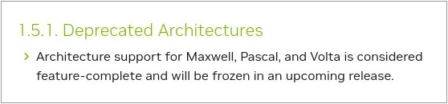
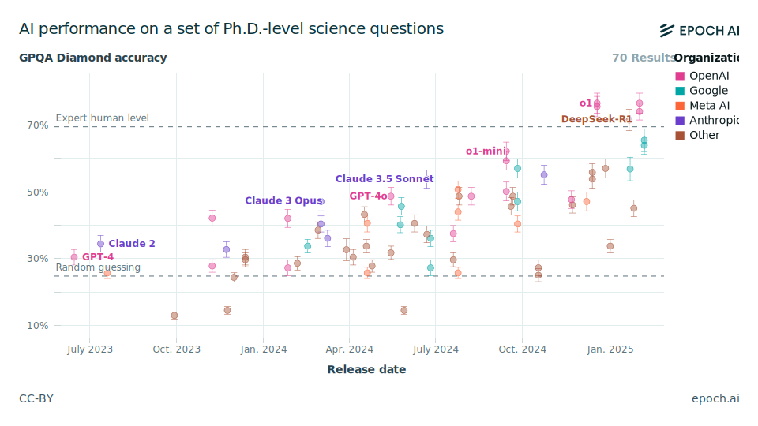
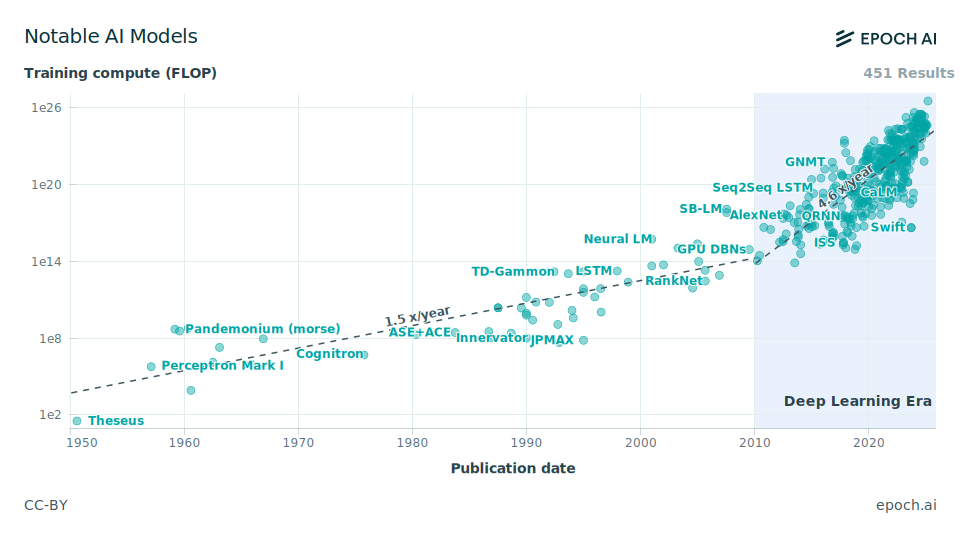
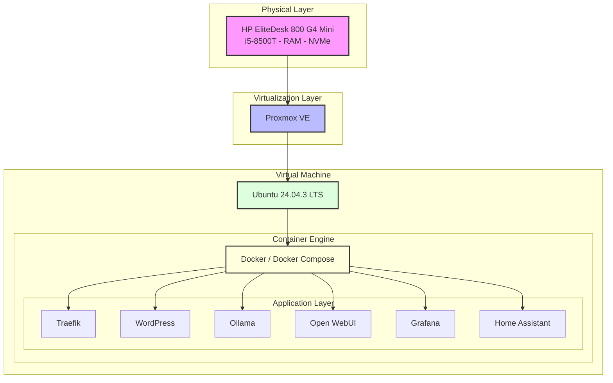

# ML - machine learning


This is just a documentation of my learning progress starting 2018. From 2024 on I created a few subfolders:

- [llama.cpp](./llama.cpp)
- [ollama](./ollama)
- [deepseek](./deepseek)

## 2018 - Start with Object Detection

Inspired by object detection for cars with DarkNet (see this [TED talk from 2017](https://www.youtube.com/watch?v=Cgxsv1riJhI) by Joseph Redmon) and David's bachelor work at [HCMUTE](http://en.hcmute.edu.vn/) in connection with a car at the end of 2018 I started to learn more about machine learning.

Posenet runs on TensorFlow.lite in a browser on WebGL even on a smartphone. We tested it in December 2018 in Seoul, Korea. In March 2019 I got TensorFlow.js running with my RX470 with 43 fps. 


During 2019 NVIDIA announced the [Jetson Nano](https://en.wikipedia.org/wiki/Nvidia_Jetson) developer kit and with students from AISVN we tried to win one in a competition. Eventually we ordered a package.


Early 2020 some supply chains delay orders, but we finally have the hardware. Now it needs to be combined - and development stalls until 2024.

### Facemesh example

<!--

-->


### Schedule for 2020

In [this article](https://towardsdatascience.com/from-a-complete-newbie-to-passing-the-tensorflow-developer-certificate-exam-d919e1e5a0f3) Harsheev Desai describes his journey to become a TensorFlow Developer with Certificate in 5 months.

#### 1. Learn Python
- [Python bootcamp at udemy](https://www.udemy.com/course/complete-python-bootcamp/)
- [Coursera python](https://www.coursera.org/specializations/python#courses)
- [List of 10 courses at medium.com](https://medium.com/better-programming/top-5-courses-to-learn-python-in-2018-best-of-lot-26644a99e7ec)

#### 2. Learn Machine Learning Theory
 
- [Coursera Machine Learning](https://www.coursera.org/learn/machine-learning/home/welcome) on Statistics, Calculus and Linear Algebra

#### 3. Learn Data Science Libraries

Some of these libraries are Pandas (data manipulation and analysis), Numpy (support for multi-dimensional arrays and matrices), Matplotlib (plotting) and Scikitlearn (creating ML models).

- [Pandas videos](https://www.youtube.com/playlist?list=PLeo1K3hjS3uuASpe-1LjfG5f14Bnozjwy)
- [NumPy videos](https://www.youtube.com/watch?v=QUT1VHiLmmI) or [freeCodeCamp](http://freecodecamp.org/)
- [MatPlotLib videos](https://www.youtube.com/playlist?list=PLQVvvaa0QuDfefDfXb9Yf0la1fPDKluPF)
- [Scikitlearn at udemy](https://www.udemy.com/course/machinelearning/) or [3 hour video](https://www.youtube.com/watch?v=pqNCD_5r0IU)

#### 4. Deep Learning Theory

- [Coursera Deep Learning](https://www.coursera.org/specializations/deep-learning?#courses)
- [Inner workings of DNN in practical implementations](https://medium.com/analytics-vidhya/what-i-learned-from-building-a-deep-neural-network-from-scratch-and-why-you-should-do-it-too-a2e6f422d3db)

#### 5. TensorFlow Certificate

- [Coursera TensorFlow in Practice](https://www.coursera.org/professional-certificates/tensorflow-in-practice#courses)

One reason for tensorflow can be seen in this graph regarding popularity on [stackoverflow](https://stackoverflow.co/):


More about the tensorflow certificate [here on medium](https://medium.com/@harshit_tyagi/google-certified-tensorflow-developer-learning-plan-tips-faqs-my-journey-9f88016048e3). It was [launched in March 2020](https://blog.tensorflow.org/2020/03/introducing-tensorflow-developer-certificate.html) but ceased to exist [by 2024](https://www.tensorflow.org/certificate). The data science hype, once reflected on platforms like [towardsdatascience](https://towardsdatascience.com/) and [medium.com](https://medium.com/) has subsided. The focus has shifted to innovations like transformers and ChatGPT, which have been the "hot new thing" since 2022. Nevertheless, I took the opportunity to learn Python, Pandas, NumPy, Matplotlib, Deep Learning, Machine Learning, and Neural Networks along the way. NumPy and Pandas have now surpassed tensorflow and pytorch on [stackoverflow](https://survey.stackoverflow.co/2024/).

## 2022 - Teach ML in [Advanced Automation](https://github.com/ssis-aa) at SSIS in Unit 5


As covered in a [SSIS Stories](https://www.ssis.edu.vn/student-life/post-details/~board/hs/post/robots-on-a-roll-automation-and-algorithms) in March 2022 we made great progress in creating our own Neural Network, Training it and then doing interference on them. See also [our website](https://sites.google.com/ssis.edu.vn/automation).

If you think about possible learning experiences, we tried a few ones with our students:

- __Create__ your own neural network, generate training data, __train__ your model (with loss and test) and then use the trained model (__inference__). It was part of the SSIS course _Advanced Automation_ [https://github.com/ssis-aa/machine-learning](https://github.com/ssis-aa/machine-learning)
- __Image classification__: Select training data (for example of seagulls) and train a ML model in xcode on your Mac to properly identify your test set of images. It was part of the SSIS course App Development
- Build your __own GPT__. A phantastic course by Andrej Karpathy with his [nanoGPT](https://github.com/karpathy/nanoGPT) model guides you in a [2-hour video](https://www.youtube.com/watch?v=kCc8FmEb1nY) to create endless Shakespeare. With Googles offerings inside a [Colab Jupyter notebook](https://colab.research.google.com/drive/1JMLa53HDuA-i7ZBmqV7ZnA3c_fvtXnx-?usp=sharing) you can train your model without a GPU just in the cloud for free.
- Run your __local LLM__. With Meta providing the weights for their llama model with 8b, 70b and 405b parameter it is possible in 2024 to run a LLM on your local CPU or GPU. OF course there are some limitations in speed and VRAM size, but that's part of the learning. [Ollama](https://ollama.com/) is a good starting point.
- Update your local LLM with RAG (Retrieval Augmented Generation) with links to your documents in `open-webui/backend/data/docs`

## 2024 - start with LLMs

Andrej Karpathy offers a step-by-step guide to build your own Generative Pre-trained Transformer (GPT) starting with 1,000,000 characters from Shakespeare that you can train on your own GPU. Well, at least if it supports CUDA >7.0, otherwise the [triton compiler](https://github.com/triton-lang/triton) throws an error (like on my slightly older GTX 960):

``` sh
torch._dynamo.exc.BackendCompilerFailed: backend='inductor' raised:
RuntimeError: Found NVIDIA GeForce GTX 960 which is too old to be supported by the triton GPU compiler, which is used
as the backend. Triton only supports devices of CUDA Capability >= 7.0, but your device is of CUDA capability 5.2
```

Let's see what I have and what CUDA Compute Capabilities (CC) these support:

| GPU name      | Cores |  CC |      at     | architecture | RAM GB |
|---------------|------:|:------------------:|:-----------:|--------------|-------:|
| Quadro FX 580 |    32 | 1.1 | hp Z600     | [Tesla](https://en.wikipedia.org/wiki/Tesla_(microarchitecture)) (2006) |    0.5 |
| GTX 650       |   384 | 3.0 | E3-1226 v3  | [Kepler](https://en.wikipedia.org/wiki/Kepler_(microarchitecture)) (2012) |     1 |
| GT 750M       |   384 | 3.0 | MBPr15 2014 | Kepler (2012) |   0.5 |
| M1000M        |   512 | 5.0 | Zbook 15 G3 | Kepler (2012) |     1 |
| GTX 960       |  1024 | 5.2 | E5-2696 v3  | Maxwell (2014) |    2 |
| Jetson Nano   |   128 | 5.3 |             | [Maxwell](https://en.wikipedia.org/wiki/Maxwell_(microarchitecture)) (2014) |    4 |
| GTX 1060      |  1280 | 6.1 | i3-6100     | [Pascal](https://en.wikipedia.org/wiki/Pascal_(microarchitecture)) (2016)  |    6 |
| T4            |  2560 | 7.5 | Google Colab | Turing (2018) |   16 |
| RTX 2080 Ti   |  4352 | 7.5 | i5-7600K    | [Turing](https://en.wikipedia.org/wiki/Turing_(microarchitecture)) (2018)  |   11 |
| RTX 3060 Ti   |  4864 | 8.6 | i7-8700     | Ampere (2020)  |    8 |
| RTX 3070 Ti   |  6144 | 8.6 | i3-10100    | [Ampere](https://en.wikipedia.org/wiki/Ampere_(microarchitecture)) (2020)  |    8 |

Only __two__ of 8 are supported by the Triton GPU compiler. How about a newer GPU? At least I can use the T4 in Google's colaboratory for free. The training takes one hour. And you get two hours for free. Ollama only needs CUDA Compute Capability 5.0 and can therefore run on 5 of my graphic cards. Plus the RX 6600 with ROCm and a hack.

### Triton Compatibility (supported hardware):

- NVIDIA GPUs (Compute Capability 7.0+)
- AMD GPUs (ROCm 5.2+)
- Under development: CPUs

My AMD RX 470, RX 580 and RX 6600 are too old to be [supported by ROCm](https://rocm.docs.amd.com/en/latest/compatibility/compatibility-matrix.html), even though the 6600 already uses [RNDA2](https://en.wikipedia.org/wiki/RDNA_2). The RX 6600 can be used if the llvm target is overwritten to be gfx1030 instead of [gfx1032](https://rocm.docs.amd.com/projects/install-on-windows/en/latest/reference/system-requirements.html). The ROCm installation needs 30 GB! In this regard it seems Nvidia has been ahead of the game for some time now with their proprietary  [CUDA since 2007](https://en.wikipedia.org/wiki/CUDA). Support for the first Tesla GPUs with Compute Capability 1.1 was only dropped with CUDA SDK 7.0 in 2016. For the current CUDA SDK 12.0 (since 2022) a CC of 5.0 (Maxwell and newer since 2014) is required. That's true [for ollama](https://github.com/ollama/ollama/blob/main/docs/gpu.md), too. In 2024 that's 10 year old hardware.

### 2025 Legacy status for 5.0 [Maxwell](https://en.wikipedia.org/wiki/Maxwell_(microarchitecture)), 6.0 [Pascal](https://en.wikipedia.org/wiki/Pascal_(microarchitecture)) and 7.0 [Volta](https://en.wikipedia.org/wiki/Volta_(microarchitecture))

With the release of the [Blackwell](https://en.wikipedia.org/wiki/Blackwell_(microarchitecture)) GPUs of the [GeForce RTX 50 series](https://en.wikipedia.org/wiki/GeForce_RTX_50_series) early 2025 a new version of the SDK was released with version [CUDA 12.8](https://docs.nvidia.com/cuda/cuda-toolkit-release-notes/index.html). Under **1.5.1 Deprecated Architectures** it states: Architecture support for Maxwell, Pascal, and Volta is considered feature-complete and will be frozen in an upcoming release. Found on [phoronix.com 2025-01-24](https://www.phoronix.com/news/Maxwe--Pascal-Volta-Legacy-Near).



It looks like [Turing](https://en.wikipedia.org/wiki/Turing_(microarchitecture)) is still new enough to receive more updates and features with Compute Capability 7.5 since the new Ray-Tracing (RT) cores are included. This is found in [GeForce 16 series](https://en.wikipedia.org/wiki/GeForce_16_series) and [GeForce 20 series](https://en.wikipedia.org/wiki/GeForce_RTX_20_series). Another rationale could be the GSP (GPU System Processor) that is supported since driver 510 and integrated in the 20 series onward, while initially only used for enterprise solutions.

## Inference on local hardware

### Early 2023: MacBook Pro M1 with 8GB RAM

In early 2023 I ran a 8b parameter model with a 4 bit quantization on my MacBook Pro at SSIS. It was impressive to see what's possible with just 8GB of RAM on a laptop! 

### Early 2024: Workstation with E5-2696v3 18C/36T and 128 GB ECC RAM

It became obvious that you need more RAM for larger models, so I built a new workstation with 128 GB RAM and a 18-core E5-2696 v3 CPU in early 2024. Well, it became another learning experience:


Turns out that the token creation rate is inversely proportional to the size of the model! Or the time to create a token for the answer (TG) is proportional to the RAM speed. A large model might fit into your RAM or VRAM, but the larger the model, the slower an answer will be. The above graph has quantization int4 to fp16, yet the speed for TG is not related to the number of parameters or speed of the GPU, but the model size in RAM - at least for TG. Not a new insight, [on llama.cpp](https://github.com/ggerganov/llama.cpp/discussions/4167) there are conversations and graphs related to this topic and Apple hardware. No wonder I get only 0.2 tokens/s for the larger 70b parameter if only using DDR3 ECC RAM. And that 4-bit quantized models are almost as precise as the full fp16 ones was tested in a paper 2023-02-28 ([The case for 4-bit precision: k-bit Inference Scaling Laws](https://arxiv.org/pdf/2212.09720)). With a quarter the size you could fit a model with 4x the parameters in RAM, or get the same model to work 4x faster. Since RAM size and RAM speed are both expensive.


I found 20 tokens/s and faster to be a usable speed to use an LLM, and looking at the graph you see what hardware you will need. CPUs are out of the question. Both RX 6600 and RTX 3060 Ti have 8GB of RAM. I got the RX 6600 for $130 and the RTX 3060 Ti for $200. To get the same tokens/s that I have with 8b models, but for a 70b model I would need a RTX 6000 Ada with 48 GB of RAM for $6000. And even that is by far not enough for a 405b model. Yet the possible accuracy would be nice:


Measurements above are done by Meta.

### Correlation Model Size and TG token generation - October 2024

After some test runs with ollama in October 2024, reading documentation and the results of other people running tests it seems like there is a simple relationship for the token generation speed $T$ from the RAM bandwidth $B$ in GB/s and the model size $M$ in RAM in GB. I found an almost linear fit with a factor of 1.1, here simplified to 1:


This approximated linear relation can be seen in the Apple Silicon graph in the last paragraph, but it seems to be not linear above 400 GB/s. My experiments show an almost linear relationship, if you convert token/s back to time per token:


What's with the M CPUs from Apple? [Anandtech tested the memory bandwidth](https://www.anandtech.com/show/17024/apple-m1-max-performance-review/2) for the Ultra CPU and found that the CPU can't use all the memory bandwidth (M1 128bit wide, M2 Pro 256 bit wide, M4 Max 512 bit wide, M2 Ultra 1024 bit wide). Maybe the reason is that the 8 LPDDR5 128bit controller have to move the data across the chip to the GPU in some instances. Here is a die picture just from the M1 Max chip, see how much area is used just for the memory controllers:

<!--

-->


The two M1 Max chips that are connected with some 10000 traces on the 2.5D chip packaging interposer for 2.5 TB/s bandwidth. This should be enough for the "just" 0.8 TB/s memory bandwidth, but maybe it's not always as aligned as wanted, or a better driver would improve speed there. So that the GPU cores have their dedicated RAM segment to work on and little data has to be moved over the UltraFusion interface. [Anandtech wrote about](https://www.anandtech.com/show/17306/apple-announces-m1-ultra-combining-two-m1-maxes-for-even-more-performance) this technology in 2022. [Another test in 2023](https://macperformanceguide.com/MacPro2023-MemoryBandwidth.html) only saw 240 GB/s for the M2 Ultra - limit for the CPU? Anyway, here my findings for memory speed in a table:

| CPU        | Memory             | GByte/s | x | GPU           | Memory             | GByte/s |
|------------|--------------------|---------|---|---------------|--------------------|---------|
| E3-1226 v3 | DDR3 1333          |      22 |   | [Jetson Nano](https://www.techpowerup.com/gpu-specs/jetson-nano.c3643)   | 4GB LPDDR4 64bit   |      25 |
| i7-8700    | DDR4 2666          |      35 |   | [Quadro M1000M](https://www.techpowerup.com/gpu-specs/quadro-m1000m.c2739) | 2GB GDDR5 128bit   |      80 |
| i7-13700T  | DDR4 3200 128bit   |      43 |   | [P106-100](https://www.techpowerup.com/gpu-specs/p106-100.c2980)      | 6GB GDDR5 192bit   |     192 |
| Apple M1   | LPDDR4X 4266       |      66 |   | [RTX 3070 Ti](https://www.techpowerup.com/gpu-specs/geforce-rtx-3070-ti.c3675)   | 8 GB GDDR6X 256bit |     608 |
| M3 Max     | LPDDR5 6400 512bit |     409 |   | [P100](https://www.techpowerup.com/gpu-specs/tesla-p100-pcie-16-gb.c2888)          | 16 GB HBM2 4096bit |     732 |
| M4 Max     | LPDDR5X 8533       |     546 |   | [RTX 6000 Ada](https://www.techpowerup.com/gpu-specs/rtx-6000-ada-generation.c3933)  | 48 GB GDDR6 384bit |     960 |

And while news to me, this very limit of the response time in LLMs is long known in the industry. And there are some novel ideas on how to circumvent the "latency bottleneck".

### Faster inference with speculative execution

Just reading the process and analyzing my findings this approach seems obvious. For one token the entire model has to be loaded from the VRAM into the cache of the GPU and processed. But most of the time the GPU is just waiting for new data to arrive. If we had a good guess for the next token, we could process the extended prompt at the same time with no measurable increased time to generate a token, but we would have 2 tokens generated! Here are some papers about this:

- [Accelerating Large Language Model Decoding with Speculative Sampling](https://arxiv.org/pdf/2302.01318), paper by DeepMind, 2023/02/02
- [Cascade Speculative Drafting for Even Faster LLM Inference](https://arxiv.org/pdf/2312.11462), [Ziyi Chen](https://openreview.net/profile?id=~Ziyi_Chen8) at University of Illinois, 2024/02/27
- [Speculative Decoding — Make LLM Inference Faster](https://medium.com/ai-science/speculative-decoding-make-llm-inference-faster-c004501af120) Improve LLM inference speed by 2–3X without degrading any accuracy, Luv Bansal on medium.com, 2024/04/08
- [Beyond the Speculative Game: A Survey of Speculative Execution in Large Language Models](https://arxiv.org/pdf/2404.14897), *Beijing Institute of Technology*, China, 2024/04/23
- [Async/parallel speculative execution with llama.cpp](https://github.com/ggerganov/llama.cpp/discussions/6853), okuvshvnov, 2024/04/24
- [SpecExec: Massively Parallel Speculative Decoding for Interactive LLM Inference on Consumer Devices](https://www.together.ai/blog/specexec), article on together.ai, 2024-06-18

The above papers indicate that 2x or even 3x would be possible. I think you need very good conditions to achive that result - but from a probablility standpoint. One factor is that the speculation of further token takes up a considerable amount of time, and you want it to be fast (and small). On the other hand you want to have a high success rate. I played around with some parameters in a [Google Sheet](https://docs.google.com/spreadsheets/d/1SNf6ulzuzFyCcL6kMPn3qZZKFgRWvbiTxRUIxrRnBsk/edit?usp=sharing) and set the success rate to 90% and made the speculative model 20x faster/smaller. In this case the large model produces a token every 100ms, and the speculative model every 5 ms. Here is the result:


I can't get to 2x with these values. I would need a much smaller model that is 50x smaller/faster than the large model to hit 2.37x.

### Early 2025: Multi GPU machine for fast Inference

After learning in October 2024 that I not only need a lot of RAM, but it also needs to be fast - preferably VRAM - I frankensteined a damaged EVGA Z170 mainboard together with a cheap i3-6100 CPU and four graphics cards (plus one integrated) for a penta-GPU server:

 

### Summer 2025: Training with unsloth and Triton on Ampere GPU on dedicated server

The machine is a i7-8700 with a RTX 3060 Ti. With only 8GB VRAM we are limited to smaller models, but with [unsloth.ai](https://unsloth.ai/) we can offload many layers and make better use of the system RAM.

## Improved performance of LLMs in just 1.5 years

With the open source model Deepseek R1 published early 2025 the gap between closed source and open source models became narrower again. [epoch.ai](https://epoch.ai/) has some interactive graphs, for example the [following one](https://epoch.ai/data/ai-benchmarking-dashboard) for the [GPQA](https://github.com/idavidrein/gpqa) Diamond questions.



The article [How Far Behind Are Open Models?](https://epoch.ai/blog/open-models-report) explores this topic further in detail, for example in benchmarks like [GPQA](https://huggingface.co/papers/2311.12022), 

It seems that the use of GPUs with AlexNet in 2014 changed the speed of development (and willingness to deploy resources) significantly (from [notable AI models](https://epoch.ai/data/notable-ai-models)):



For comparison my experience, taken from my [benchmark repository](https://kreier.github.io/benchmark/). FLOPS only $10^9$ to $10^{14}$, equal to $10^{16}$ to $10^{21}$ when running for 115 days (4 months).


Combined:


## Slow LLM server in a container

Let's hope this Mermaid diagram is shown on the webpage:



## Lessons learned so far

- 2023/03/05 Larger models are better, you need more RAM. More **expensive**.
- 2024/07/10 Faster GPUs generate the tokens faster. Faster means more **expensive**.
- 2024/07/20 You need newer GPUs. At least [Maxwell](https://en.wikipedia.org/wiki/Maxwell_(microarchitecture)) ([CUDA](https://en.wikipedia.org/wiki/CUDA) Compute Capability 5.0) for inference with ollama. You need at least [Volta](https://en.wikipedia.org/wiki/Volta_(microarchitecture)) (Cuda CC 7.0) to run the Triniton compiler if you build your own nanoGPT. The newer, the more **expensive**.
- 2024/10/05 It's actually the memory speed. Faster GPUs in general also have faster memory access. Only for the first PP (prompt processing) stage you need raw GPU power, after that in TG (token generation) or EV (evaluation) it is mainly RAM bandwidth. And again, faster RAM is more **expensive**.
- 2024/11/10 Finally a reason to have more VRAM for the GPU and really fast memory. For smartphones: To use AI you need more memory. Flagships in Android had a lot of RAM compared to Apples offerings, but no convincing use case. With AI its capacity and speed! And in a way Apple was prepared for years with how the M1 was designed. Now all phones have 8 GB RAM.
- 2024/11/25 Speculative execution could speed up things.
- 2025/02/20 I've been using quantized models for years now. But there are different type of layers that react differently to quantization, and are unique in their dimension. More in the [Visual Guide to Quantization](https://www.maartengrootendorst.com/blog/quantization/) from Maarten Grootendorst. Including GPTQ and GGUF.
- 2025/05/01 [MoE](https://en.wikipedia.org/wiki/Mixture_of_experts) will speed up things! Since only a fraction of the model needs to be processed with the context, the speedup could be in the range of the number of experts. [Llama 4 Scout](https://ai.meta.com/blog/llama-4-multimodal-intelligence/) has 16 experts, only 17B active parameters of the 109B total parameters are active at one given time. That's 6.4x. Unfortunately the whole model needs to be in VRAM - [65.6GB for Q4_K_XL from unsloth](https://huggingface.co/unsloth/Llama-4-Scout-17B-16E-Instruct-GGUF). My quad-gpu server has only 24 GB VRAM. And Llama 4 Maverick with 128 experts would even need [243GB with Q4_K_XL (4.5bit)](https://huggingface.co/unsloth/Llama-4-Maverick-17B-128E-Instruct-GGUF). BF16: 801GB. At least theoretically 23x faster. Selective loading to VRAM from SSD? [math](chatgpt/moe-math.md). And one day later [IBM releases Granite 4.0](https://www.ibm.com/new/announcements/ibm-granite-4-0-tiny-preview-sneak-peek) - combining [MoE](https://www.ibm.com/think/topics/mixture-of-experts) with Mamba (6S) and other details!


## History

- __October 2018__ Successful installed darknet on ubuntu, object detection works for stills. Don't have a webcam, and the video does not work yet.
- __December 2018__ TensorFlow.lite in a browser on my iPhone 7 runs at 6 fps, demonstrated in Seoul
- __March 2019__ posenet runs in the browser with new RX470 with 43 fps
- __December 2019__ On [hackster.io](https://hackster.io) starts a new competition [AI at the Edge Challenge](https://www.hackster.io/contests/NVIDIA) where you can win a Jetson Nano. I apply and eventually just buy one from [arrow](https://www.arrow.com/)
- __February 2020__ The Jetson car is purchased, Wifi module and 7" display as well. Needs completion - without students due to COVID-19
- __July 2024__ Reactivated the [https://kreier.github.io/jetson-car/](https://kreier.github.io/jetson-car/) project. The hardware is from 2019 (NVIDIA) but the software is still Ubuntu 18.04 LTS. Updates brake simple things like `make` and `gcc`.
- __August 2024__ Started to work on [https://kreier.github.io/nano-gpt/](https://kreier.github.io/nano-gpt/) to learn more about LLMs, following Andrej Karpathy's project [https://github.com/karpathy/nanogpt](https://github.com/karpathy/nanogpt)
- __December 2024__ Local Proxmox server with i7-8700 and RTX 3060 Ti running [llama3.1:8b](https://ollama.com/library/llama3.1) in [ollama](https://ollama.com/) over [open-webui](https://openwebui.com/) and [tailscale](https://tailscale.com/)
- __January 2025__ Compiled [llama.cpp](https://github.com/ggml-org/llama.cpp) on some of [my machines](https://github.com/kreier/ml/tree/main/llama.cpp). Later included support to download from huggingface, and CUDA support.
- __February 2025__ Finished the multi-GPU LLM machine. Now needs more software models to run on, and Grafana visualization of the utilization.
- __January 2026__ The multi-GPU LLM machine is finally working. Down to just 3 GPUs with a total of 22 GB VRAM it is ok for [translategemma 27b](https://ollama.com/library/translategemma) and [glm-4.7-flash 30B](https://ollama.com/library/glm-4.7-flash) over Open WebUI
