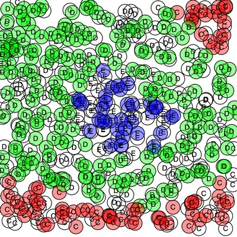

# Pictures for documentation and visualisation

## 2019 Posenet with RX 470

2019-03_thepark.jpg with posenet in a browser on RX470 and 43 fps

## 2020 Facemesh and possible learning of Tensorflow

tensorflow_stack_overflow.png on popularity of tensorflow (Google) vs. pytorch (Facebook)

## 2022 Neural Networks and ML in Advanced Automation, using p5js

## 2024 Performance and Accuracy of local LLMs

I did some performance tests myself, and the accuracy was tested by Meta itself

